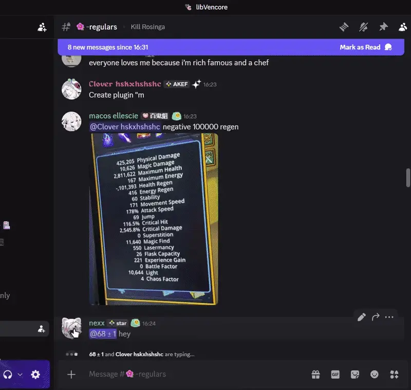
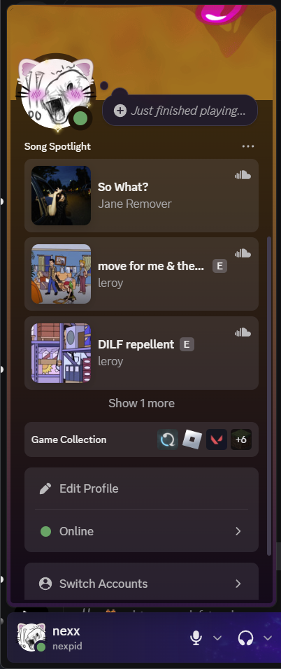
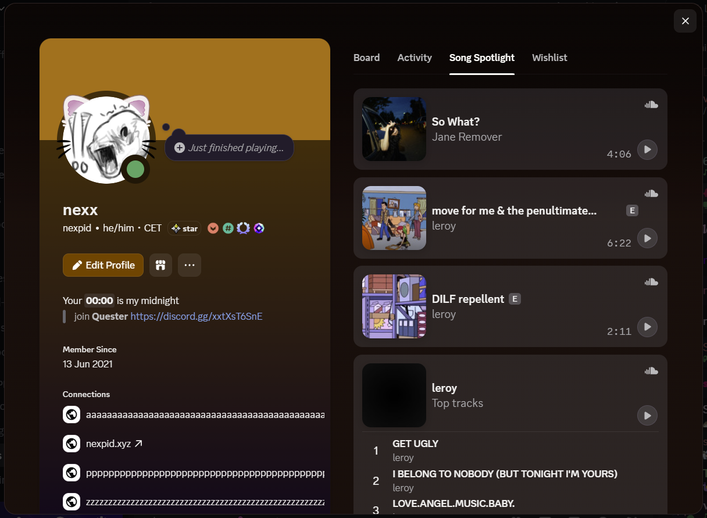

# Song Spotlight

A Vencord plugin which lets users add songs from **Spotify**, **Soundcloud**, **Apple Music**, **Tidal** and **song.link** to their profile.

You can also easily import/export your Song Spotlight as JSON or [add the userapp](https://discord.com/oauth2/authorize?client_id=1157745434140344321) and use the **`/songspotlight`** command.

## Previews

## Installation

Please read the [Vencord documentation](https://docs.vencord.dev/installing/custom-plugins) or use [Equicord](https://equicord.org/plugins/SongSpotlight)!
